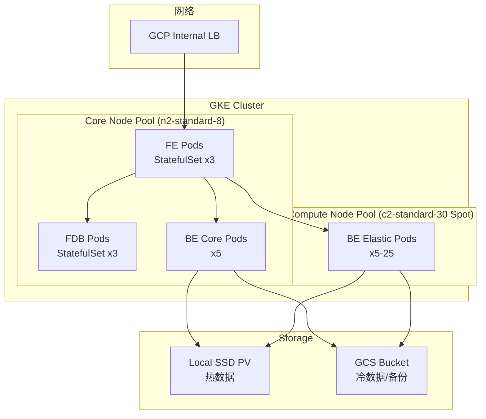

## 产品概述

设计一套基于 GKE (Google Kubernetes Engine) 的高性能 Doris 集群部署方案，支持超大规模数据实时写入和查询，并通过 Kubernetes 的弹性伸缩能力优化成本。

**特殊环境要求**：公司内网部署，专用 VPC，与外界隔离，使用内部 Nexus Docker 镜像仓库。

## 核心特性

- **GKE 容器化部署**: 使用 Kubernetes 部署 Doris，实现高弹性伸缩
- **内网隔离部署**: Private GKE Cluster，完全内网环境，支持离线部署
- **Nexus 镜像适配**: 所有镜像从公司内部 Nexus 仓库拉取，支持离线部署
- **高性能写入**: 每批次 50 亿行、90 列宽表在 2 分钟内完成写入
- **低延迟查询**: 1000 亿行星型模型表查询 <10s，支持 50 并发用户
- **成本优化**: 核心节点使用常规实例，弹性节点使用 Spot VM，节省 60-80% 成本
- **自动化运维**: 节点自动扩缩容 + Pod 自动扩缩容，基于时段策略

## 技术栈选择

### GKE 集群配置

- **集群类型**: GKE Standard (灵活节点配置)
- **Kubernetes 版本**: 1.28+
- **网络**: VPC Native 模式，**Private Cluster** (无公网 IP)
- **镜像仓库**: 公司内部 Nexus Docker 仓库
- **网络访问**: Private Google Access (访问 GCS)

### 节点池设计

| 节点池 | 实例类型 | 用途 | Spot | 规模 |
| --- | --- | --- | --- | --- |
| core-pool | n2-standard-8 | FE/FDB/核心 BE | No | 3-5 节点 |
| compute-pool | c2-standard-30 | BE 计算节点 | Yes | 5-30 节点 |


### 存储架构

- **热存储**: Local SSD (NVMe, 通过 Local PV)
- **冷存储**: GCS (通过 GCS Fuse 或 S3 API)

### Doris 部署方案

- **方式**: Doris Operator (官方推荐) + Helm Chart
- **组件**:
- FE: StatefulSet (3 副本)
- FDB: StatefulSet (3-5 副本)
- BE: StatefulSet (动态扩缩容)

## 实现方案

### 1. GKE 集群架构



### 2. 自动扩缩容策略

- **Cluster Autoscaler**: 节点池自动扩缩容
- **HPA (Horizontal Pod Autoscaler)**: BE Pod 数量基于 CPU/内存
- **时段策略**: 
- 繁忙时段 (08:00-22:00): BE Pod 15-25 个
- 非繁忙时段 (22:00-08:00): BE Pod 5-10 个

### 3. 目录结构

```
doris-gke-cluster/
├── terraform/
│   ├── main.tf                    # GKE 集群、VPC、GCS 资源
│   ├── variables.tf               # 变量定义
│   ├── outputs.tf                 # 输出配置
│   ├── terraform.tfvars.prod      # 生产环境配置
│   └── modules/
│       ├── gke-cluster/           # GKE 集群模块
│       └── storage/               # 存储资源模块
├── kubernetes/
│   ├── namespace.yaml             # 命名空间
│   ├── doris-operator/            # Doris Operator
│   │   ├── operator.yaml
│   │   └── crds/
│   ├── doris-cluster/             # Doris 集群配置
│   │   ├── fe.yaml                # FE StatefulSet
│   │   ├── fdb.yaml               # FDB StatefulSet
│   │   ├── be.yaml                # BE StatefulSet + HPA
│   │   └── configmaps/            # 配置文件
│   ├── storage/
│   │   ├── local-pv.yaml          # Local SSD PV
│   │   └── storage-class.yaml     # 存储类
│   └── autoscaling/
│       ├── hpa-be.yaml            # BE HPA 配置
│       └── cron-schedule.yaml     # 时段扩缩容
├── scripts/
│   ├── deploy.sh                  # 一键部署脚本
│   ├── destroy.sh                 # 销毁集群脚本
│   ├── scale.sh                   # 手动扩缩容脚本
│   └── test-load.sh               # 负载测试脚本
├── configs/
│   ├── be.conf                    # BE 性能调优配置
│   ├── fe.conf                    # FE 性能调优配置
│   └── fdb.conf                   # FDB 配置
└── docs/
    ├── ARCHITECTURE.md            # 架构文档
    ├── DEPLOYMENT-GUIDE.md        # 详细部署指南
    ├── TUNING.md                  # 性能调优指南
    └── COST-OPTIMIZATION.md       # 成本优化说明
```

## 关键配置示例

### BE HPA 配置

```
apiVersion: autoscaling/v2
kind: HorizontalPodAutoscaler
metadata:
  name: doris-be-hpa
spec:
  scaleTargetRef:
    apiVersion: apps/v1
    kind: StatefulSet
    name: doris-be
  minReplicas: 5
  maxReplicas: 25
  metrics:
  - type: Resource
    resource:
      name: cpu
      target:
        type: Utilization
        averageUtilization: 60
  behavior:
    scaleUp:
      stabilizationWindowSeconds: 180
      policies:
      - type: Pods
        value: 5
        periodSeconds: 60
    scaleDown:
      stabilizationWindowSeconds: 600
```

### BE 性能配置 (ConfigMap)

```
apiVersion: v1
kind: ConfigMap
metadata:
  name: doris-be-config
data:
  be.conf: |
    # 并行执行
    parallel_fragment_exec_instance_num = 16
    
    # 导入性能
    streaming_load_max_mb = 10240
    streaming_load_rpc_max_alive_time_sec = 1200
    
    # 内存配置
    memory_limitation_per_thread_for_schema_change = 4294967296
    
    # 缓存配置
    enable_query_cache = true
    query_cache_capacity = 40GB
```

## 成本估算

| 项目 | 配置 | 月成本 |
| --- | --- | --- |
| GKE 控制平面 | Autopilot 费用 | ~$70 |
| Core 节点池 | 5x n2-standard-8 | ~$800 |
| Compute 节点池 (Spot) | 10x c2-standard-30 (平均) | ~$1,200 |
| Local SSD | 3TB x 15 节点 | ~$500 |
| GCS 存储 | 50TB | ~$1,150 |
| 网络流量 | 估算 | ~$200 |
| **总计** |  | **~$3,920/月** |


相比全常规实例方案节省约 **45%**。

## 实施要点

1. 先创建 GKE 集群和存储资源
2. 部署 Doris Operator
3. 按顺序部署 FDB → FE → BE
4. 配置自动扩缩容和监控
5. 运行负载测试验证性能

## Agent Extensions

### SubAgent

- **code-explorer**
- Purpose: 探索现有 Terraform 配置结构、Kubernetes 配置模式，确保新方案符合项目规范
- Expected outcome: 识别现有配置模式，生成符合项目风格的 GKE 配置文件