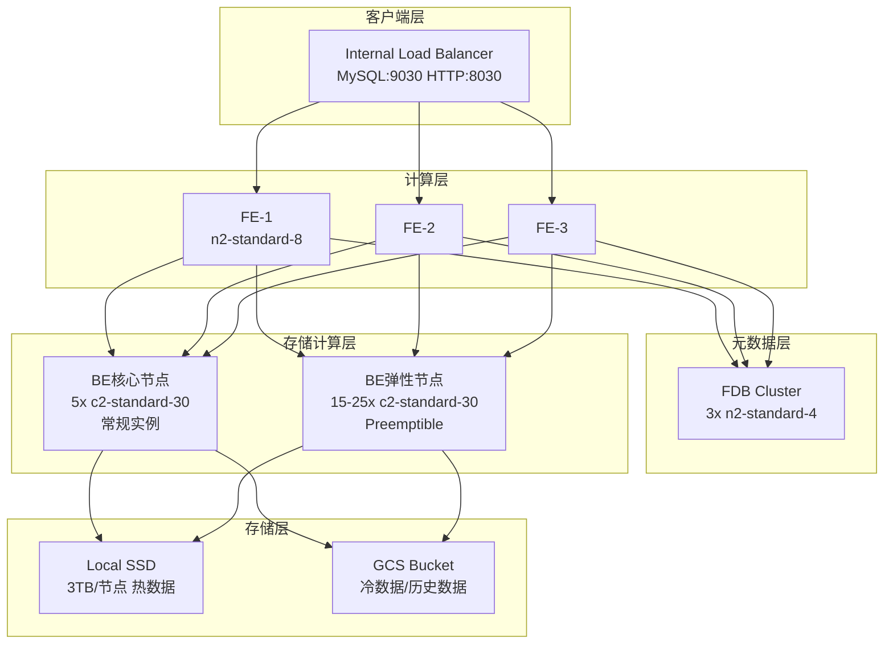

## 产品概述

针对用户的高性能实时分析需求，设计一套GCP平台上的Doris集群优化方案，满足海量数据实时写入和查询的性能要求，同时控制成本。

## 核心特性

- **高性能实时写入**: 每批次50亿行、90列宽表数据在2分钟内完成写入
- **低延迟实时查询**: 1000亿行星型模型表查询响应时间低于10秒，支持50并发用户
- **成本优化**: 利用GCP Preemptible实例和时段性扩缩容策略降低成本
- **弹性扩展**: 支持繁忙/非繁忙时段的动态资源调整，适应数据持续增长

## 技术栈选择

### 计算实例类型

- **BE节点**: `c2-standard-30` 或 `n2-standard-32` (Compute Optimized系列)
- 高CPU性能(30-32 vCPU)，适合计算密集型查询
- 高内存(120-128GB)，支持大表缓存和复杂查询
- **FE节点**: `n2-standard-8` (8 vCPU, 32GB内存)
- **FDB节点**: `n2-standard-4` (4 vCPU, 16GB内存)

### 存储配置

- **热存储**: Local SSD (NVMe, 375GB x 8 = 3TB/节点)
- **冷存储**: GCS Standard/Nearline分级存储

### 导入方案

- Stream Load并行导入 + Broker Load批量导入

## 实现方案

### 1. 性能优化策略

#### 写入性能优化

```
目标: 50亿行/2分钟 ≈ 41.7M rows/s
策略:
├── 并行导入: 10-20个并发Stream Load任务
├── BE节点: 15-20节点(繁忙时段)
├── 分桶策略: 按主键Hash分桶，每表96-128个桶
└── 内存缓冲: 增大streaming_load_rpc_max_alive_time_sec
```

#### 查询性能优化

```
目标: 1000亿行查询<10s，50并发
策略:
├── 星型模型: 事实表按时间分区+维度键分桶
├── 物化视图: 预聚合高频查询
├── Colocate Group: 维度表与事实表同分布
├── 并行度: parallel_fragment_exec_instance_num=8-16
└── 缓存: 开启Query Cache和Partition Cache
```

### 2. 成本优化策略

#### 实例混合部署

| 组件 | 实例类型 | Preemptible | 用途 |
| --- | --- | --- | --- |
| FE | n2-standard-8 | No | 核心服务，稳定性优先 |
| FDB | n2-standard-4 | No | 元数据存储，高可用优先 |
| BE(核心) | c2-standard-30 | No | 最小规模，保证基线性能 |
| BE(弹性) | c2-standard-30 | Yes | 繁忙时段扩展，降低60%成本 |


#### 时段性扩缩容

```
时间窗口规划:
├── 繁忙时段(08:00-22:00): BE节点 15-25台
│   └── 触发条件: CPU > 50% 持续3分钟
├── 非繁忙时段(22:00-08:00): BE节点 5-10台
│   └── 触发条件: CPU < 30% 持续10分钟
└── 批量导入窗口: 额外扩展至30台
```

### 3. 架构设计



### 4. 表设计最佳实践

```sql
-- 事实表设计(90列宽表)
CREATE TABLE fact_events (
    event_id BIGINT,
    event_time DATETIME,
    user_id BIGINT,
    dim_key1 INT,
    dim_key2 INT,
    -- ... 86 more columns
    metric1 DOUBLE,
    metric2 DOUBLE
)
PARTITION BY RANGE(event_time) (
    PARTITION p202602 VALUES [('2026-02-01'), ('2026-03-01')),
    PARTITION p202603 VALUES [('2026-03-01'), ('2026-04-01'))
)
DISTRIBUTED BY HASH(user_id) BUCKETS 128
PROPERTIES (
    "replication_num" = "2",
    "storage_policy" = "hot_to_cold",
    "storage_cooldown_time" = "7 DAY",
    "enable_unique_key_merge_on_write" = "true",
    "light_schema_change" = "true"
);

-- 维度表(Colocate Group)
CREATE TABLE dim_user (
    user_id BIGINT,
    user_name VARCHAR(100),
    -- ...
)
DISTRIBUTED BY HASH(user_id) BUCKETS 128
PROPERTIES (
    "replication_num" = "3",
    "colocate_with" = "fact_events_group"
);
```

## 目录结构

```
doris-gcp-cluster/
├── terraform.tfvars.high-performance  # [NEW] 高性能配置文件，定义实例类型、存储、扩缩容参数
├── variables.tf                       # [MODIFY] 添加高性能实例类型变量、时段性扩缩容变量
├── main.tf                           # [MODIFY] 支持Preemptible混合部署、Local SSD配置
├── user-data-be.sh                   # [MODIFY] 添加Local SSD挂载、性能参数调优
├── scripts/
│   ├── tuning-be.conf                # [NEW] BE性能调优配置模板
│   └── tuning-fe.conf                # [NEW] FE性能调优配置模板
└── ARCHITECTURE-HIGH-PERFORMANCE.md  # [NEW] 高性能架构文档
```

## 实施要点

### 性能参数调优

- `streaming_load_max_mb`: 10240 (单次导入最大10GB)
- `streaming_load_rpc_max_alive_time_sec`: 1200
- `parallel_fragment_exec_instance_num`: 16
- `query_cache_capacity`: 40GB
- `memory_limitation_per_thread_for_schema_change`: 4294967296

### 监控指标

- 导入吞吐量: rows/s、bytes/s
- 查询P99延迟
- BE节点CPU/内存/IO利用率
- 存储分层迁移速率

### 成本预估

- 核心集群(非Preemptible): ~$3,500/月
- 弹性节点(Preemptible): ~$1,500/月(繁忙时段)
- 存储(GCS+Local SSD): ~$800/月
- **总计**: ~$5,800/月(较全常规实例节省约40%)

## Agent Extensions

### SubAgent

- **code-explorer**
- Purpose: 探索现有Terraform配置和脚本结构，确保优化方案与现有代码风格一致
- Expected outcome: 识别现有配置模式，确保新配置文件和脚本符合项目规范