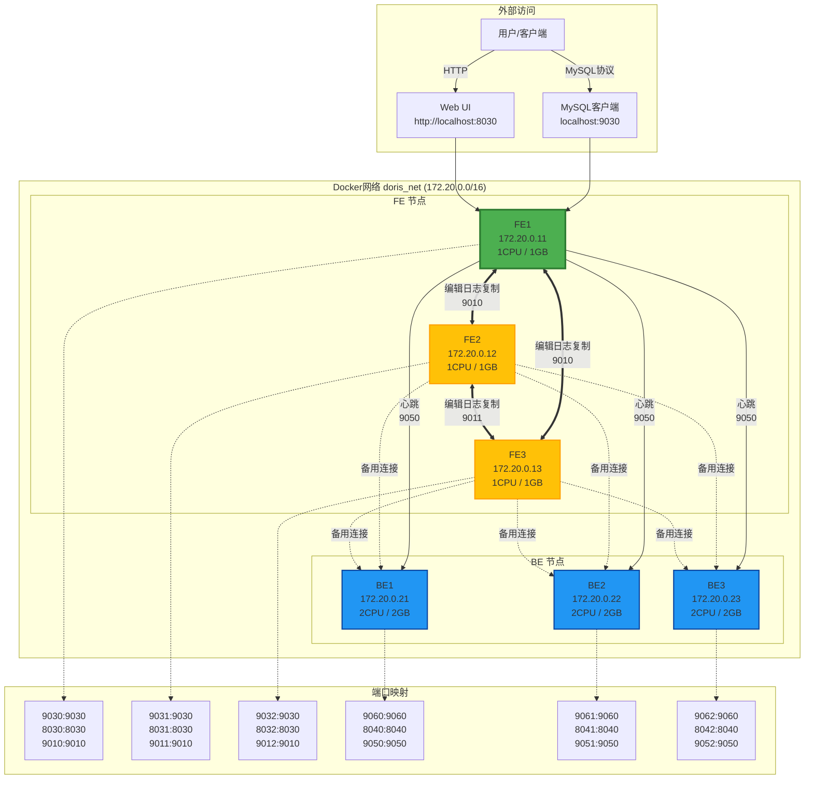

# Doris 集群 Docker 部署指南

## 概述

本部署方案使用 Docker Compose 部署一个生产级别的 Doris 集群，包含 3 个 FE 节点和 3 个 BE 节点。

## 集群架构

### 架构图



### 节点配置

| 节点 | IP地址 | 角色 | CPU | 内存 | 端口 |
|------|---------|------|------|------|------|
| FE1 | 172.20.0.11 | Master | 1核 | 1GB | 9030(MySQL), 8030(HTTP), 9010(编辑日志) |
| FE2 | 172.20.0.12 | Follower | 1核 | 1GB | 9031(MySQL), 8031(HTTP), 9011(编辑日志) |
| FE3 | 172.20.0.13 | Follower | 1核 | 1GB | 9032(MySQL), 8032(HTTP), 9012(编辑日志) |
| BE1 | 172.20.0.21 | Backend | 2核 | 2GB | 9060(BePort), 8040(HttpPort), 9050(心跳) |
| BE2 | 172.20.0.22 | Backend | 2核 | 2GB | 9061(BePort), 8041(HttpPort), 9051(心跳) |
| BE3 | 172.20.0.23 | Backend | 2核 | 2GB | 9062(BePort), 8042(HttpPort), 9052(心跳) |

### 网络拓扑

- 所有节点在 `doris_net` 桥接网络中（172.20.0.0/16）
- FE 节点之间通过编辑日志端口（9010/9011/9012）进行数据复制
- BE 节点向 FE1 发送心跳（端口9050）
- 用户通过端口映射访问集群服务

- **FE 节点**: 3 个（高可用）
  - fe1: 172.20.0.11
  - fe2: 172.20.0.12
  - fe3: 172.20.0.13

- **BE 节点**: 3 个
  - be1: 172.20.0.21
  - be2: 172.20.0.22
  - be3: 172.20.0.23

## 系统要求

- Docker 20.10+
- Docker Compose 2.0+
- 至少 8GB 可用内存
- 至少 50GB 可用磁盘空间

## 快速开始

### 1. 配置资源（可选）

如需调整资源限制，编辑 `.env` 文件：

```bash
# 编辑 .env 文件
notepad .env  # Windows
vi .env       # Linux/Mac
```

### 2. 启动集群

Windows 系统:
```bash
start-cluster.bat
```

Linux/Mac 系统:
```bash
chmod +x start-cluster.sh
./start-cluster.sh
```

### 2. 停止集群

Windows 系统:
```bash
stop-cluster.bat
```

Linux/Mac 系统:
```bash
docker-compose down
```

## 访问集群

### Web UI

- FE1: http://localhost:8030
- FE2: http://localhost:8031
- FE3: http://localhost:8032

### MySQL 客户端

```bash
mysql -h 127.0.0.1 -P 9030 -u root
```

## 配置说明

### 环境变量配置 (.env)

所有配置参数通过 `.env` 文件统一管理：

```bash
# 镜像配置
DORIS_REGISTRY=zlsmshoqvwt6q1.xuanyuan.run
DORIS_VERSION=4.0.2

# 资源配置（可根据需要调整）
DORIS_FE_MEMORY=1G
DORIS_BE_MEMORY=2G
DORIS_FE_CPUS=1
DORIS_BE_CPUS=2

# 健康检查配置
DORIS_HEALTHCHECK_INTERVAL=10s
DORIS_HEALTHCHECK_TIMEOUT=5s
DORIS_HEALTHCHECK_RETRIES=5
DORIS_HEALTHCHECK_START_PERIOD=60s

# 网络配置
DORIS_NETWORK_SUBNET=172.20.0.0/16
```

### FE 配置

- **内存**: 1GB（可通过 .env 调整）
- **CPU**: 1核（可通过 .env 调整）
- **端口**:
  - 9030: MySQL 协议端口
  - 8030: HTTP 端口
  - 9010: Edit Log 端口

### BE 配置

- **内存**: 2GB（可通过 .env 调整）
- **CPU**: 2核（可通过 .env 调整）
- **端口**:
  - 9060: Thrift 端口
  - 8040: Web Server 端口
  - 9050: Heartbeat 端口

## 生产环境优化建议

### 1. 资源配置

根据实际负载调整 CPU 和内存限制：

```yaml
deploy:
  resources:
    limits:
      cpus: '8'      # 调整为实际可用CPU核心数
      memory: 16G     # 调整为实际可用内存
```

### 2. 存储优化

- 使用 SSD 存储以提高性能
- 为数据目录配置单独的磁盘
- 定期清理日志文件

### 3. 网络优化

- 使用 host 网络模式以提高网络性能
- 配置合适的 MTU 值
- 启用网络性能优化参数

### 4. 安全配置

- 修改默认密码
- 启用 SSL/TLS 加密
- 配置防火墙规则
- 限制网络访问

### 5. 监控配置

- 集成 Prometheus 监控
- 配置 Grafana 仪表板
- 设置告警规则

## 常见问题

### 1. 容器启动失败

检查日志：
```bash
docker logs doris_fe1
docker logs doris_be1
```

### 2. 节点无法连接

检查网络配置：
```bash
docker network inspect doris-cluster_doris_net
```

### 3. 性能问题

- 检查资源使用情况
- 调整 JVM 参数
- 优化查询语句

## 维护操作

### 查看 FE 状态

```bash
docker exec doris_fe1 mysql -h 127.0.0.1 -P 9030 -u root -e "SHOW FRONTENDS;"
```

### 查看 BE 状态

```bash
docker exec doris_fe1 mysql -h 127.0.0.1 -P 9030 -u root -e "SHOW BACKENDS;"
```

### 扩容 BE 节点

1. 修改 docker-compose.yml 添加新的 BE 节点
2. 启动新节点
3. 在 FE 中添加新节点

```bash
docker exec doris_fe1 mysql -h 127.0.0.1 -P 9030 -u root -e "ALTER SYSTEM ADD BACKEND '新BE_IP:9050';"
```

### 备份与恢复

备份元数据：
```bash
docker exec doris_fe1 cp -r /opt/doris/fe/doris-meta /backup/
```

恢复元数据：
```bash
docker exec doris_fe1 cp -r /backup/doris-meta /opt/doris/fe/
```

## 监控与日志

### 查看日志

```bash
# FE 日志
docker logs doris_fe1

# BE 日志
docker logs doris_be1

# 进入容器查看详细日志
docker exec -it doris_fe1 tail -f /opt/doris/fe/log/fe.log
```

### 性能监控

```bash
# 查看容器资源使用
docker stats

# 查看集群状态
docker exec doris_fe1 mysql -h 127.0.0.1 -P 9030 -u root -e "SHOW PROC '/statistic';"
```

## 故障排查

### FE 无法启动

1. 检查端口占用
2. 检查内存配置
3. 查看日志文件
4. 检查网络连接

### BE 无法加入集群

1. 检查 FE 地址配置
2. 检查网络连通性
3. 检查防火墙规则
4. 查看 BE 日志

### 数据不一致

1. 检查副本配置
2. 执行数据修复命令
3. 检查磁盘空间

## 技术支持

- Doris 官方文档: https://doris.apache.org/docs/
- Doris GitHub: https://github.com/apache/doris
- Doris 邮件列表: dev@doris.apache.org

## 许可证

Apache License 2.0
