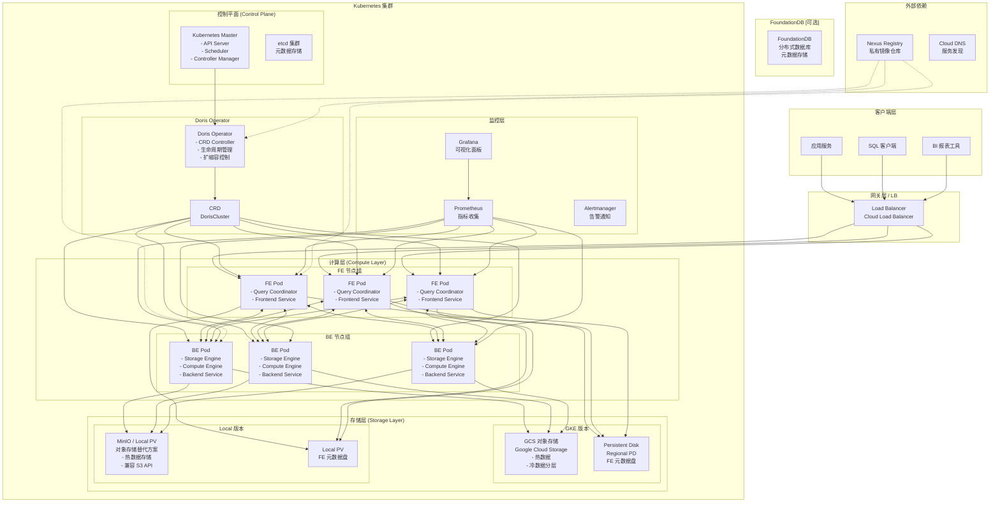
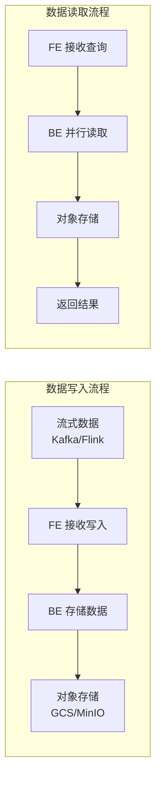
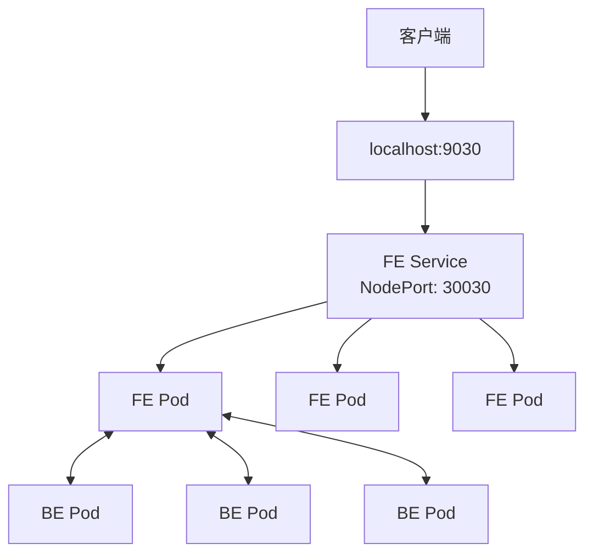

# Doris Kubernetes 部署架构图

## 1. 整体架构



## 2. 组件说明

### 2.1 控制平面组件

| 组件 | 版本 | 说明 | GKE | Local |
|------|------|------|-----|-------|
| Kubernetes | 1.28+ | 容器编排平台 | ✅ GKE 自动管理 | ✅ Docker Desktop 内置 |
| etcd | 内置 | Kubernetes 元数据存储 | ✅ GKE 自动管理 | ✅ Docker Desktop 内置 |
| API Server | 内置 | K8s API 服务 | ✅ | ✅ |
| Scheduler | 内置 | Pod 调度 | ✅ | ✅ |
| Controller Manager | 内置 | 控制器管理 | ✅ | ✅ |

### 2.2 Doris 组件

| 组件 | 说明 | 端口 | GKE | Local |
|------|------|------|-----|-------|
| **FE (Frontend)** | 查询协调器，负责 SQL 解析、规划、调度 | 8030 (HTTP)<br/>9030 (MySQL)<br/>9010 (RPC) | ✅ | ✅ |
| **BE (Backend)** | 存储和计算节点，负责数据存储和查询执行 | 8040 (HTTP)<br/>9050 (RPC)<br/>9060 (Arrow Flight) | ✅ | ✅ |
| **CN (Compute Node)** | 纯计算节点，无存储，用于弹性计算 | 8040 (HTTP)<br/>9060 (Arrow Flight) | 可选 | 可选 |
| **Doris Operator** | Kubernetes Operator，管理 DorisCluster CRD | - | ✅ | ✅ |

### 2.3 存储组件

| 存储类型 | 说明 | 适用场景 | GKE | Local |
|----------|------|----------|-----|-------|
| **GCS (Google Cloud Storage)** | 对象存储，S3 兼容 | 热数据、冷数据分层 | ✅ | ❌ |
| **Regional PD (Persistent Disk)** | 区域级块存储 | FE 元数据、BE 本地缓存 | ✅ | ❌ |
| **MinIO** | S3 兼容对象存储 | Local 版本对象存储替代 | ❌ | ✅ |
| **Local PV** | 本地持久化存储 | FE 元数据 | ❌ | ✅ |
| **hostPath** | 主机路径映射 | 临时开发测试 | ❌ | ⚠️ 不推荐 |

### 2.4 监控组件

| 组件 | 说明 | 用途 | GKE | Local |
|------|------|------|-----|-------|
| **Prometheus** | 时序数据库 | 指标收集 | ✅ | ✅ |
| **Grafana** | 可视化平台 | 图表展示 | ✅ | ✅ |
| **Alertmanager** | 告警管理 | 告警通知 | ✅ | ✅ |
| **node-exporter** | 节点指标 | 基础设施监控 | ✅ | ✅ |
| **kube-state-metrics** | K8s 对象状态 | K8s 对象监控 | ✅ | ✅ |

### 2.5 可选组件

| 组件 | 说明 | 用途 | GKE | Local |
|------|------|------|-----|-------|
| **FoundationDB** | 分布式数据库 | 替代 etcd 的元数据存储 | 可选 | 可选 |
| **Nexus** | 镜像仓库 | 私有镜像存储 | 可选 | 可选 |
| **Kafka** | 消息队列 | 实时数据摄入 | 可选 | 可选 |

## 3. 数据流架构



## 4. GKE 生产架构

```
┌─────────────────────────────────────────────────────────────────────────┐
│                          Google Cloud Platform                           │
│                                                                          │
│  ┌──────────────────────────────────────────────────────────────────┐   │
│  │                      Kubernetes Engine (GKE)                      │   │
│  │                                                                   │   │
│  │   ┌─────────────┐     ┌─────────────┐     ┌─────────────┐      │   │
│  │   │   FE Pod    │     │   FE Pod    │     │   FE Pod    │      │   │
│  │   │  (3副本)    │     │  (3副本)    │     │  (3副本)    │      │   │
│  │   └──────┬──────┘     └──────┬──────┘     └──────┬──────┘      │   │
│  │          │                   │                   │              │   │
│  │          └───────────────────┼───────────────────┘              │   │
│  │                              │                                  │   │
│  │                              ▼                                  │   │
│  │   ┌─────────────┐     ┌─────────────┐     ┌─────────────┐      │   │
│  │   │   BE Pod    │     │   BE Pod    │     │   BE Pod    │      │   │
│  │   │  (N 副本)   │     │  (N 副本)   │     │  (N 副本)   │      │   │
│  │   │  存储计算   │     │  存储计算   │     │  存储计算   │      │   │
│  │   └──────┬──────┘     └──────┬──────┘     └──────┬──────┘      │   │
│  │          │                   │                   │              │   │
│  │          └───────────────────┼───────────────────┘              │   │
│  │                              │                                  │   │
│  │                              ▼                                  │   │
│  │                    ┌─────────────────┐                          │   │
│  │                    │   GCS 对象存储  │                          │   │
│  │                    │  (热数据/冷数据)│                          │   │
│  │                    └────────┬────────┘                          │   │
│  │                             │                                   │   │
│  └─────────────────────────────┼───────────────────────────────────┘   │
│                                │                                       │
│  ┌─────────────────────────────┼───────────────────────────────────┐   │
│  │                        Cloud Storage                              │   │
│  └─────────────────────────────────────────────────────────────────┘   │
│                                                                          │
└─────────────────────────────────────────────────────────────────────────┘
```

## 5. Local 开发架构 (存储计算分离)

```
┌─────────────────────────────────────────────────────────────────────────┐
│                     Docker Desktop Kubernetes                            │
│                                                                          │
│  ┌──────────────────────────────────────────────────────────────────┐   │
│  │                      Local K8s Cluster                            │   │
│  │                                                                   │   │
│  │   ┌─────────────┐     ┌─────────────┐     ┌─────────────┐      │   │
│  │   │   FE Pod    │     │   FE Pod    │     │   FE Pod    │      │   │
│  │   │  (3副本)    │     │  (3副本)    │     │  (3副本)    │      │   │
│  │   │  元数据存储 │     │  元数据存储 │     │  元数据存储 │      │   │
│  │   └──────┬──────┘     └──────┬──────┘     └──────┬──────┘      │   │
│  │          │                   │                   │              │   │
│  │          └───────────────────┼───────────────────┘              │   │
│  │                              │                                  │   │
│  │                              ▼                                  │   │
│  │   ┌─────────────┐     ┌─────────────┐     ┌─────────────┐      │   │
│  │   │   BE Pod    │     │   BE Pod    │     │   BE Pod    │      │   │
│  │   │  (N 副本)   │     │  (N 副本)   │     │  (N 副本)   │      │   │
│  │   │  纯计算     │     │  纯计算     │     │  纯计算     │      │   │
│  │   └──────┬──────┘     └──────┬──────┘     └──────┬──────┘      │   │
│  │          │                   │                   │              │   │
│  │          └───────────────────┼───────────────────┘              │   │
│  │                              │                                  │   │
│  │                              ▼                                  │   │
│  │   ┌─────────────────────────────────────────────────────┐      │   │
│  │   │                    MinIO 对象存储                    │      │   │
│  │   │              (S3 兼容 API - 替代 GCS)               │      │   │
│  │   └─────────────────────────────────────────────────────┘      │   │
│  │                                                                   │   │
│  └───────────────────────────────────────────────────────────────────┘   │
│                                                                          │
│  ┌───────────────────────────────────────────────────────────────────┐   │
│  │                        MinIO 单机/集群                              │   │
│  │                    (替代 GCS 的本地方案)                           │   │
│  └───────────────────────────────────────────────────────────────────┘   │
│                                                                          │
└─────────────────────────────────────────────────────────────────────────┘
```

## 6. 存储计算分离架构对比

### 6.1 GKE 版本 (GCS)

| 组件 | 存储方式 | 说明 |
|------|----------|------|
| FE 元数据 | Regional PD | 高可用区域级存储 |
| BE 数据 | GCS | 对象存储，弹性扩展 |
| BE 缓存 | Local SSD / Memory | 热数据加速 |

### 6.2 Local 版本 (MinIO)

| 组件 | 存储方式 | 说明 |
|------|----------|------|
| FE 元数据 | Local PV (HostPath) | 本地持久化存储 |
| BE 数据 | MinIO (S3 兼容) | 对象存储替代方案 |
| BE 缓存 | Local SSD / Memory | 热数据加速 |

## 7. 性能指标与架构关系

### 7.1 性能要求

| 指标 | 要求 | 说明 |
|------|------|------|
| **数据规模** | 50亿行 × 70列 | ~500GB 原始数据 |
| **写入时间** | < 5分钟 | 单批次写入 |
| **查询时间** | < 8秒 | 复杂聚合查询 |
| **大批次** | > 20个/天 | 每个 > 1亿行 |
| **小批次** | 1000个/天 | 每个 < 1亿行 |

### 7.2 架构设计对应的性能优化

```
┌────────────────────────────────────────────────────────────────────┐
│                        性能优化架构                                 │
├────────────────────────────────────────────────────────────────────┤
│                                                                     │
│  ┌──────────────┐      ┌──────────────┐      ┌──────────────┐     │
│  │   数据分区   │ ───▶ │   并行写入   │ ───▶ │  批量提交    │     │
│  │  (Partition) │      │  (Partition) │      │  (Batch)    │     │
│  └──────────────┘      └──────────────┘      └──────────────┘     │
│         │                    │                     │              │
│         ▼                    ▼                     ▼              │
│  ┌────────────────────────────────────────────────────────────┐   │
│  │                      写入优化                                │   │
│  │  • 分区键设计 (Partition Key)                               │   │
│  │  • Bucket 数量 (8-16个/BE节点)                              │   │
│  │  • 批量大小 (10000-50000行/批次)                            │   │
│  │  • 压缩算法 (ZSTD 压缩)                                    │   │
│  └────────────────────────────────────────────────────────────┘   │
│                                                                     │
│  ┌──────────────┐      ┌──────────────┐      ┌──────────────┐     │
│  │   物化视图   │ ───▶ │   预聚合     │ ───▶ │   裁剪分区   │     │
│  │  (Rollup)   │      │  (Pre-Agg)  │      │  (Pruning)  │     │
│  └──────────────┘      └──────────────┘      └──────────────┘     │
│         │                    │                     │              │
│         ▼                    ▼                     ▼              │
│  ┌────────────────────────────────────────────────────────────┐   │
│  │                      查询优化                                │   │
│  │  • 列式存储 (Columnar Format)                               │   │
│  │  • 向量化执行 (Vectorized Execution)                         │   │
│  │  • 谓词下推 (Predicate Pushdown)                           │   │
│  │  • 索引优化 (MinMax/Bloom Filter)                          │   │
│  └────────────────────────────────────────────────────────────┘   │
│                                                                     │
└────────────────────────────────────────────────────────────────────┘
```

## 8. 网络架构

### 8.1 GKE 网络

```mermaid
graph TB
    CLIENT[客户端] --> LB[Cloud LB<br/>Global HTTP(S) LB]
    LB --> NEG[Network Endpoint Group]
    NEG --> FE_SVC[FE Service<br/>ClusterIP: 9030<br/>NodePort: 30030]
    FE_SVC --> FE_POD_1[FE Pod]
    FE_SVC --> FE_POD_2[FE Pod]
    FE_SVC --> FE_POD_3[FE Pod]
    FE_POD_1 <--> BE_POD_1[BE Pod]
    FE_POD_1 <--> BE_POD_2[BE Pod]
    FE_POD_1 <--> BE_POD_3[BE Pod]
```

### 8.2 Local 网络



## 9. 高可用架构

```
┌─────────────────────────────────────────────────────────────────────────┐
│                           高可用设计                                    │
├─────────────────────────────────────────────────────────────────────────┤
│                                                                         │
│  FE 高可用:                                                              │
│  ┌─────────┐  ┌─────────┐  ┌─────────┐                                 │
│  │  FE-1   │  │  FE-2   │  │  FE-3   │    Leader/Follower 模式          │
│  │ Leader  │◄─┤Follower │  │Follower │    - 写入: Leader                 │
│  └────┬────┘  └────┬────┘  └────┬────┘    - 读取: 任意节点               │
│       │            │            │           - 故障转移: 自动             │
│       └────────────┴────────────┘                                       │
│                                                                         │
│  BE 高可用:                                                              │
│  ┌─────────┐  ┌─────────┐  ┌─────────┐  ┌─────────┐                    │
│  │  BE-1   │  │  BE-2   │  │  BE-3   │  │  BE-N   │                    │
│  │  存储   │  │  存储   │  │  存储   │  │  存储   │                    │
│  └────┬────┘  └────┬────┘  └────┬────┘  └────┬────┘                    │
│       │            │            │            │                         │
│       └────────────┴────────────┴────────────┘                         │
│                           │                                             │
│                           ▼                                             │
│                   ┌───────────────┐                                      │
│                   │   数据副本    │    - 副本数: 3                       │
│                   │  (3 Replica) │    - 自动修复                        │
│                   └───────────────┘    - 负载均衡                       │
│                                                                         │
└─────────────────────────────────────────────────────────────────────────┘
```

## 10. 监控架构

```
┌─────────────────────────────────────────────────────────────────────────┐
│                           监控体系                                      │
├─────────────────────────────────────────────────────────────────────────┤
│                                                                         │
│   ┌─────────────────────────────────────────────────────────────────┐   │
│   │                     Prometheus Stack                             │   │
│   │                                                                  │   │
│   │   ┌────────────┐    ┌────────────┐    ┌────────────┐           │   │
│   │   │ Doris     │    │  node-     │    │ kube-state │           │   │
│   │   │ Exporter   │    │  exporter  │    │ -metrics   │           │   │
│   │   └─────┬──────┘    └─────┬──────┘    └─────┬──────┘           │   │
│   │         │                 │                 │                   │   │
│   │         └─────────────────┼─────────────────┘                   │   │
│   │                           │                                   │   │
│   │                           ▼                                   │   │
│   │                    ┌─────────────┐                            │   │
│   │                    │ Prometheus  │                            │   │
│   │                    │   Server    │                            │   │
│   │                    └──────┬──────┘                            │   │
│   │                           │                                   │   │
│   └───────────────────────────┼───────────────────────────────────┘   │
│                               │                                        │
│                               ▼                                        │
│   ┌─────────────────────────────────────────────────────────────────┐   │
│   │                        Grafana                                  │   │
│   │   ┌────────────┐  ┌────────────┐  ┌────────────┐              │   │
│   │   │  集群概览   │  │   FE 监控   │  │   BE 监控   │              │   │
│   │   └────────────┘  └────────────┘  └────────────┘              │   │
│   └─────────────────────────────────────────────────────────────────┘   │
│                                                                         │
│   ┌─────────────────────────────────────────────────────────────────┐   │
│   │                     Alertmanager                                │   │
│   │   告警规则:                                                      │   │
│   │   • FE/BE Pod 不健康                                            │   │
│   │   • 磁盘使用率 > 80%                                            │   │
│   │   • 查询延迟 > 10s                                             │   │
│   │   • 写入失败率 > 1%                                             │   │
│   └─────────────────────────────────────────────────────────────────┘   │
│                                                                         │
└─────────────────────────────────────────────────────────────────────────┘
```

## 11. 组件版本对照表

| 组件 | GKE 版本 | Local 版本 | 说明 |
|------|----------|------------|------|
| Doris | 2.1.x | 2.1.x | 最新稳定版 |
| Doris Operator | 25.8.0 | 25.8.0 | 离线包安装 |
| Kubernetes | 1.28+ | 1.28+ | Docker Desktop 内置 |
| MinIO | latest | localpv | S3 兼容存储 |
| Prometheus | v2.45+ | v2.45+ | 指标收集 |
| Grafana | 10.0+ | 10.0+ | 可视化 |
| kube-state-metrics | v2.10+ | v2.10+ | K8s 状态 |

## 12. 快速参考命令

```bash
# 检查集群状态
kubectl get pods -n doris
kubectl get svc -n doris
kubectl get crd dorisclusters

# 查看 FE 日志
kubectl logs -n doris -l app.kubernetes.io/component=fe -f

# 查看 BE 日志
kubectl logs -n doris -l app.kubernetes.io/component=be -f

# 连接 Doris
mysql -h127.0.0.1 -P9030 -uroot

# 查看集群状态
SHOW FRONTENDS;
SHOW BACKENDS;
SHOW PROC '/frontends';
SHOW PROC '/backends';

# 查看配置
SHOW FRONTENDS CONFIG;
SHOW BACKENDS CONFIG;
```
